# E2E Test Plan

Goal: keep the e2e suite thin. One happy-path journey per app boundary, plus the
auth/session boundaries that only a real browser or real HTTP request can prove.
Everything else (field validation, loading/error/empty states, service branching)
stays in Vitest/Jest unit and component specs — see the `e2e-testing` skill for
the full pyramid rules.

Three projects, two tools:

- `web-e2e` / `admin-e2e` — Playwright, drives the real Angular apps.
- `api-e2e` — Jest + axios, drives the real NestJS API + Postgres.

## Scope per project

### `web-e2e` (public site, unauthenticated)

- **Home → Projects → Project detail** happy path: content loads from the API
  (profile, organizations/roles, projects), navigation between pages works.
- **Contact form submission**: fill form, submit, see success state — proves the
  form wiring calls the real API client end to end.
- **Resume page gated by feature flag**: flag off → route not reachable /
  nav item hidden; flag on → page renders. (One test, both branches.)
- **404 page** for unknown routes.
- One accessibility scan (`AxeBuilder`) on the home page.

### `admin-e2e` (authenticated CMS)

- **Auth boundary**: unauthenticated visit redirects to `/login`; authenticated
  session reaches the dashboard.
- **Basic Info**: edit profile fields, save, reload shows persisted values
  (already covered by [basic-info.spec.ts](../apps/admin-e2e/src/basic-info.spec.ts) — keep).
- **Professional Journey**: create an organization, add a role under it, see
  both rendered together (already covered by
  [professional-journey.spec.ts](../apps/admin-e2e/src/professional-journey.spec.ts) — keep).
- **Projects**: create a project, see it listed (mirrors the public projects
  page being fed by the same data).
- **Messages**: a contact submission from the public site shows up in the
  admin messages list (cross-app happy path — can be done as one API-seeded
  read, doesn't need a live web submission).
- **Feature Flags**: toggle a flag, confirm it persists on reload
  (already covered by [feature-flags.spec.ts](../apps/admin-e2e/src/feature-flags.spec.ts) — keep).
- One accessibility scan on the dashboard shell.

### `api-e2e` (HTTP contract + auth)

- **Health**: `GET /api/health` returns 200 (smoke check that the server boots).
- **Auth boundary**: unauthenticated mutation on any protected resource → 401;
  authenticated session → 2xx. Assert this once via `organizations` and reuse
  the pattern rather than repeating a 401 case per module.
- **Organizations + Roles**: create/list/update/delete (already covered by
  [organizations.spec.ts](../apps/api-e2e/src/api/organizations.spec.ts),
  [roles.spec.ts](../apps/api-e2e/src/api/roles.spec.ts) — keep).
- **Profile**: read public profile, update as authenticated user (already
  covered by [profile.spec.ts](../apps/api-e2e/src/api/profile.spec.ts) — keep).
- **Projects**: create, list (public read), update, delete.
- **Contact**: public submit → 201; appears in authenticated messages list.
- **Feature Flags**: authenticated toggle, public read reflects new value.
- **Skills / Resume**: one read-path check that the resume endpoint assembles
  data from profile + organizations + roles + skills correctly (this is the
  one integration point worth an HTTP-level test; per-field logic stays unit).

Not planned as e2e (covered by unit/component tests instead): `activity`
(internal cleanup job), `storage`/presigned URL generation (mock-friendly,
no real R2 needed), and any DTO validation branch.

## Diagram

```mermaid
flowchart TB
    subgraph WEB["web-e2e (Playwright, public)"]
        W1["Home → Projects → Project detail\nhappy path"]
        W2["Contact form submit"]
        W3["Resume page: feature flag on/off"]
        W4["404 unknown route"]
        W5["A11y scan: home"]
    end

    subgraph ADMIN["admin-e2e (Playwright, authenticated)"]
        A1["Auth boundary:\nunauth → /login, auth → dashboard"]
        A2["Basic Info: edit + save"]
        A3["Professional Journey:\ncreate org + role"]
        A4["Projects: create + list"]
        A5["Messages: contact submission visible"]
        A6["Feature Flags: toggle + persist"]
        A7["A11y scan: dashboard"]
    end

    subgraph API["api-e2e (Jest + axios, HTTP)"]
        P1["Health check"]
        P2["Auth boundary:\n401 unauth, 2xx authenticated"]
        P3["Organizations + Roles CRUD"]
        P4["Profile read + update"]
        P5["Projects CRUD"]
        P6["Contact submit → Messages list"]
        P7["Feature Flags toggle → public read"]
        P8["Resume aggregation read"]
    end

    W2 -.->|"submission persisted via"| P6
    A5 -.->|"reads data seeded via"| P6
    W1 -.->|"content served by"| P3
    W1 -.->|"content served by"| P5
    W3 -.->|"flag state served by"| P7
    A2 -.->|"writes verified by"| P4
    A3 -.->|"writes verified by"| P3
    A4 -.->|"writes verified by"| P5
    A6 -.->|"writes verified by"| P7
```

